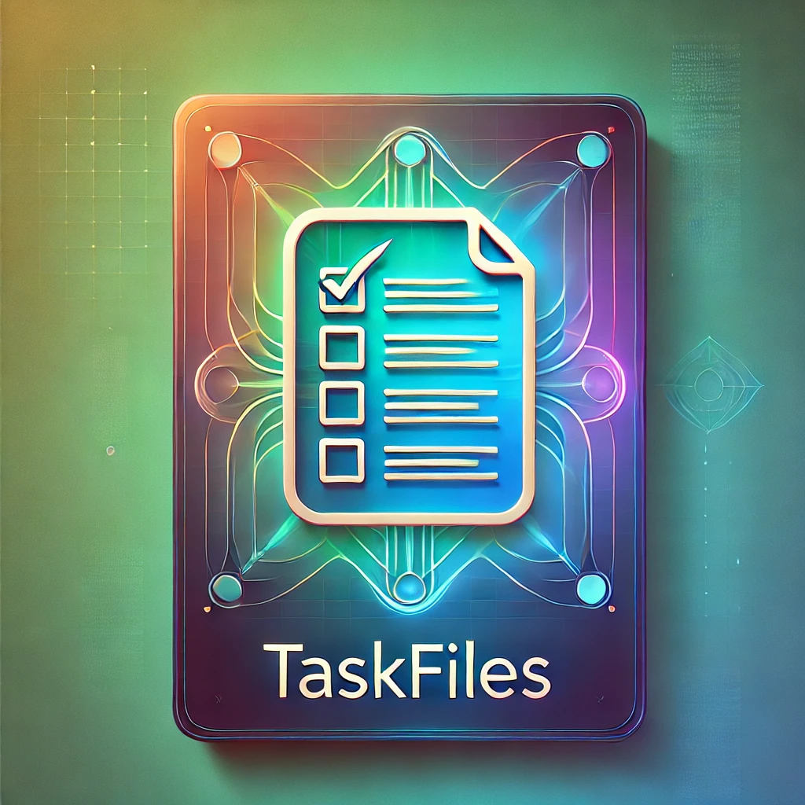

# Taskfiles



Curation of useful `Taskfiles.yml` for accomplishing tasks faster and easily!

## Installing `task`

Task is available via our official Homebrew tap:

```commandline
brew install go-task/tap/go-task
```

or,

Alternatively it can be installed from the official Homebrew repository:

```commandline
brew install go-task
```

Follow the link for more instructions options across various OS platforms: https://taskfile.dev/installation/

## Documentation

- Usage instructions: https://taskfile.dev/usage/
- Schema structuring: https://taskfile.dev/reference/schema
- Template structuring: https://taskfile.dev/reference/templating/
- CLI run options and args: https://taskfile.dev/reference/cli